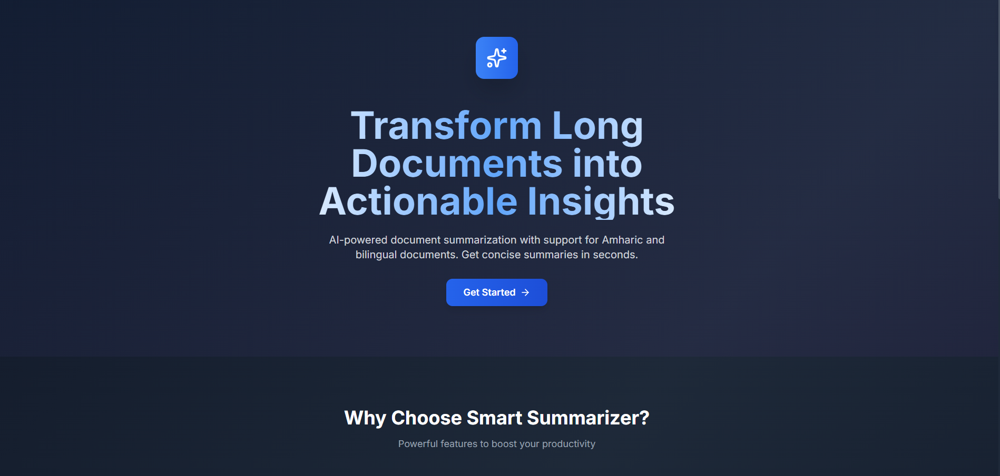

 

  

A production-ready document summarization tool with specialized support for Amharic and bilingual documents.

## Features

- 📄 **Multi-Format Input**: PDF, DOCX, TXT, URLs, and plain text
- 🇪🇹 **Amharic Support**: Native Amharic summarization with proper Fidel rendering
- 🔀 **Bilingual Documents**: Handle documents mixing Amharic and English seamlessly
- 📝 **Multiple Summary Types**: Bullet points, paragraphs, or section-based summaries
- 🎯 **Length Control**: Short, medium, or detailed summaries
- 🔑 **Keyword Extraction**: Automatic extraction of key topics and entities
- 💾 **Export Options**: Download summaries as PDF, DOCX, or TXT
- 📚 **History Tracking**: Save and manage past summaries
- 🔒 **User Authentication**: Secure JWT-based authentication
- 🚀 **Production Ready**: Dockerized, with Redis caching and PostgreSQL database

## Tech Stack

### Backend
- FastAPI (Python)
- PostgreSQL with SQLAlchemy
- Redis for caching
- OpenAI API for summarization
- PyPDF2, python-docx for document processing
- JWT authentication

### Frontend
- React 18
- Tailwind CSS
- React Router
- Axios
- React Dropzone
- React Markdown

## Quick Start

### Prerequisites
- Docker and Docker Compose
- Node.js 18+ (for local development)
- Python 3.11+ (for local development)
- Gemini API key
